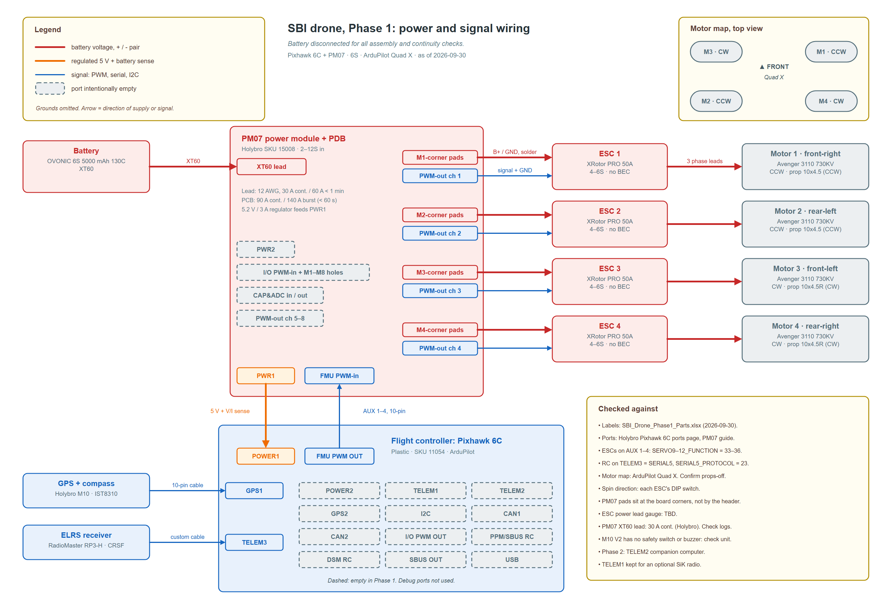

# sbi-drone-d2

SBI UT club drone. Phase 1 is a quadcopter that flies on an ArduPilot stack capable of autonomous missions. It has no payload or onboard computer yet. The motors, battery and power system are sized for the heavier Phase 2 build, so those can be added later without replacing anything.

## What's here

| Path | Contents |
| :-- | :-- |
| `SBI_Drone_Phase1_Parts.xlsx` | Phase 1 parts list: vendor, price (checked 2026-09-30), link, and why each part was chosen |
| `wiring/` | Phase 1 wiring: block diagram, KiCad schematic, wiring table, and the checks that keep them in sync. See [`wiring/README.md`](wiring/README.md) |

## Phase 1 build

- **Flight controller:** Holybro Pixhawk 6C with PM07 power module and M10 GPS, running ArduPilot
- **Propulsion:** 4x BrotherHobby Avenger 3110 730KV, 4x Hobbywing XRotor Pro 50A ESCs, 10x4.5 props, quad X
- **Power:** 6S 5000 mAh LiPo, XT60
- **RC link:** RadioMaster Pocket (ELRS 2.4 GHz) with an RP3-H receiver on TELEM3
- **Frame:** custom CNC carbon plate, about 450-500 mm wheelbase (CAD in progress)

Not yet priced: frame, McMaster hardware, LiPo bag, microSD card. The onboard computer is deferred to Phase 2.

